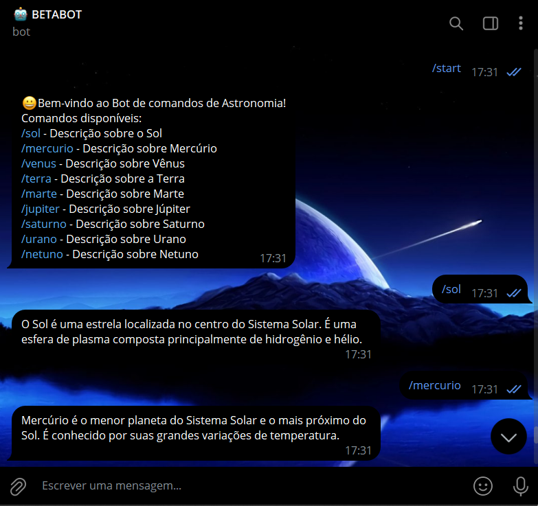

# ASTRONOMIA COM TELEPOT
🤤ESSE É UM BOT TELEGRAM, FEITO COM TELEPOT, DE TÓPICOS SOBRE OS PLANETAS DO SISTEMA SOLAR!

 <br>

## DESCRIÇÃO:
Este bot do Telegram é um bot de comandos de Astronomia que fornece informações sobre os planetas do Sistema Solar quando comandos específicos são enviados. Aqui está uma descrição ele faz:

- O bot responde a comandos específicos enviados pelos usuários relacionados aos planetas do Sistema Solar.
- Ele fornece informações básicas sobre cada planeta quando o comando correspondente é enviado.
- Inclui um comando de boas-vindas para orientar os usuários sobre os comandos disponíveis.

## EXECUTANDO O PROJETO:
1. **Coloque o Token:**
   - Antes de executar o programa, é necessário substituir o token do seu bot no arquivo `TOKEN.py`, o qual pode ser obtido por meio do [@BotFather](https://t.me/BotFather).

2. **Instalando as dependências:**
   - Antes de executar o bot, certifique-se de instalar todas as dependências necessárias. No terminal, execute o seguinte comando para instalar as dependências listadas no arquivo `requirements.txt` em `CODIGO`:
   ```bash
   pip install -r requirements.txt
   ```

3. **Inicie o Bot:**
   - Execute o bot do Telegram em Python iniciando-o com o seguinte comando:
   ```bash
   python CODIGO.py
   ```
   
   - Inicie o bot enviando o comando `/start`. Receba uma mensagem de boas-vindas e Converse.

4. **Interagindo com o Bot:**
   1. **Inicialização:**
      - Envie `/start` para iniciar o bot. Ele enviará uma mensagem de boas-vindas com uma lista de comandos disponíveis.

   2. **Comandos Disponíveis:**
      - `/sol` - Descrição sobre o Sol.
      - `/mercurio` - Descrição sobre Mercúrio.
      - `/venus` - Descrição sobre Vênus.
      - `/terra` - Descrição sobre a Terra.
      - `/marte` - Descrição sobre Marte.
      - `/jupiter` - Descrição sobre Júpiter.
      - `/saturno` - Descrição sobre Saturno.
      - `/urano` - Descrição sobre Urano.
      - `/netuno` - Descrição sobre Netuno.

   3. **Exemplo de Uso:**
      - Para obter informações sobre Marte, você pode enviar o comando `/marte`.
      - O bot responderá com uma mensagem descrevendo o planeta Marte.

## NÃO SABE?
- Entendemos que para manipular arquivos em muitas linguagens e tecnologias relacionadas, é necessário possuir conhecimento nessas áreas. Para auxiliar nesse aprendizado, oferecemos alguns subsidios:
* [VEJA A DOCUMENTAÇÃO](https://telepot.readthedocs.io/en/latest/)
* [CURSO DE PYTHON](https://github.com/VILHALVA/CURSO-DE-PYTHON)
* [CURSO SUGERIDO](https://github.com/VILHALVA/CURSO-DE-TELEBOT)
* [CONFIRA MAIS CURSOS](https://github.com/VILHALVA?tab=repositories&q=+topic:CURSO)

## CREDITOS:
- [PROJETO CRIADO PELO VILHALVA](https://github.com/VILHALVA)
